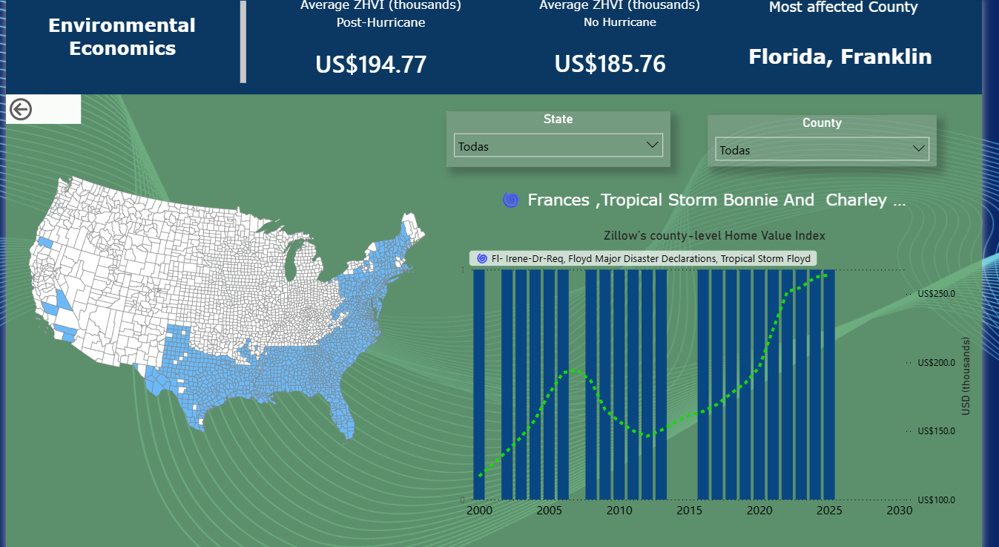
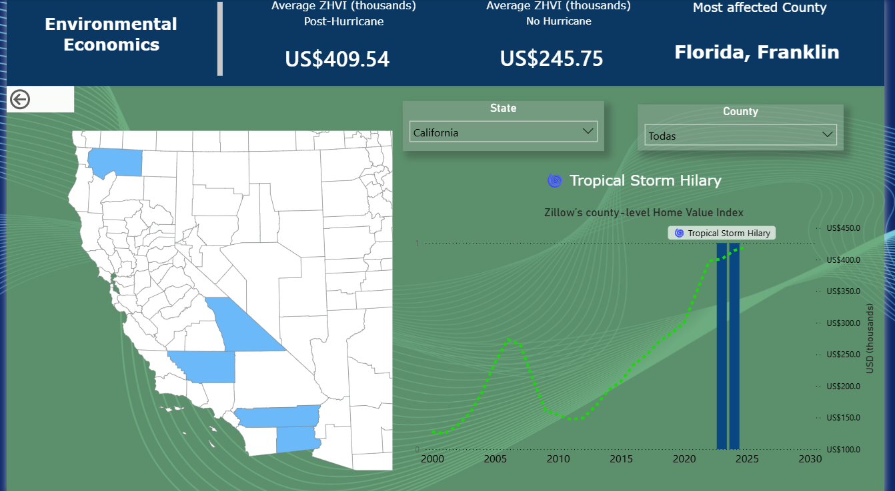
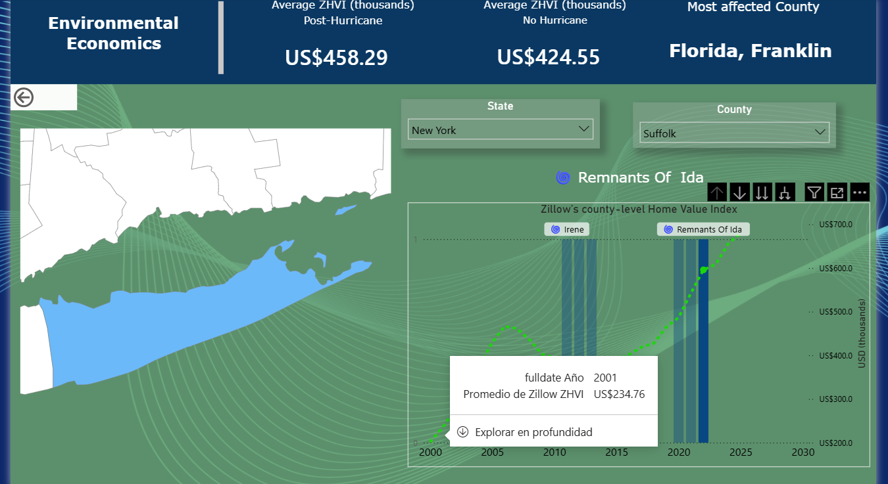

# Climate Schock on Home's market value across USA

Developed an interactive Power BI dashboard for an Environmental Economics course, examining the effect of major hurricanes on county-level real estate values across North America. The dashboard integrates Zillow's ZHVI (Zillow Home Value Index) time series data with FEMA hurricane event records.
Key features:

- Interactive U.S. map for direct county selection
- State and county dropdown filters
- Blue shaded regions marking post-hurricane periods, with clickable labels displaying hurricane names

In particular, I focus on Franklin County, as it has been affected by 15 major hurricanes since 2000, making it the most exposed county in the sample. The time series of Zillow’s county-level home values shows three main patterns. First, between 2007 and 2014, the index declines sharply due to the financial crisis and the prolonged downturn in the housing market. Second, during 2000–2005 and 2016–2019, home values exhibit a steeper upward trend. Finally, since 2020, prices appear to have stagnated. The observed increases in home values are consistent with previous findings that hurricane-affected areas may experience rising housing prices alongside a decline in transactions (Zivin et al., 2023). According to the study, physical damage reduces the effective housing supply in the short run, while severely damaged properties are less likely to be traded, lowering transaction volumes. At the same time, displaced households may temporarily relocate to nearby areas, increasing housing demand, thereby driving home value up. In addition, reconstruction efforts can improve housing quality, further contributing to higher property values. 

## Dashboard Overview

## Filtering by State

## Filtering by County   

